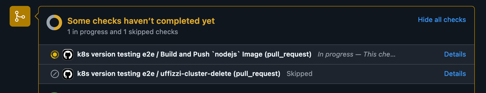
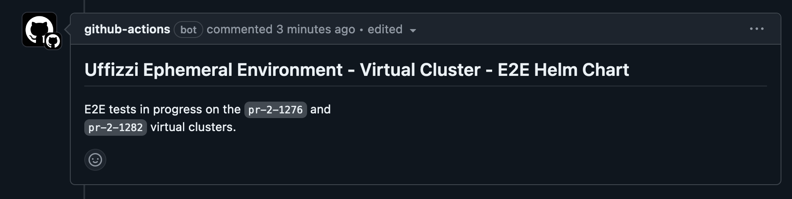
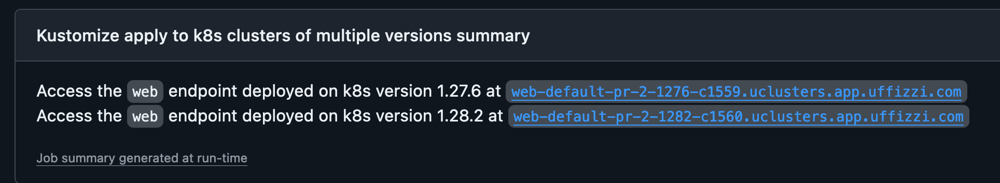

# Uffizzi Quickstart of testing multiple k8s versions (~2 min) test

This repo demonstrates how you can create Kubernetes virtual clusters of different versions on Uffizzi Cloud and use them for testing
your application running in different Kubernetes versions. 

You can choose between creating a standard [virual cluster](#create-a-virtual-cluster) or a [dev cluster](#development-dev-cluster). Dev clusters are standard virtual clusters with additional developer tooling for building, testing, and auto-deploying your local project files. [Learn more >](https://docs.uffizzi.com/docs/quickstart)

For a more in-depth understanding of why you should consider k8s version testing for your applications, checkout
our blog here.

## Prerequisites

- [Install](https://kubernetes.io/docs/tasks/tools/install-kubectl/) `kubectl`  
- [Install](https://docs.uffizzi.com/installation) the Ufizzi CLI  
- [Create an account](https://docs.uffizzi.com/installation#authentication) on Uffizzi Cloud  

## Getting Started

**1. Fork this repository and create a PR against this repo**

This will trigger the github actions workflow which will build the nodejs application and then deploy it to 
two different virtual clusters of versions 1.27 and 1.28 on Uffizzi. 

Once the PR is open and the workflow is triggered, you can see the status of the workflow in the PR checks.



The workflow will also ensure that the application is deployed successfully and is accessible via the ingress.
The names of the two clusters will be available in the PR comments and the ingresses to the deployments on the clusters
will be available in the github actions summary.




**2. Authenticate with Uffizzi and access the Uffizzi virtual clusters**

1. Login to your Uffizzi account with the CLI
``` bash
uffizzi login
```
This command will open a browser window for you to login.

2. Access the virtual clusters created by the workflow. Here we are trying to access the one with version 1.27
``` bash
# check the clusters available
uffizzi cluster list
# update the local kubconfig file with the cluster credentials
uffizzi cluster update-kubeconfig <cluster-name>
```

3. Check kubernetes version using `kubectl`
```bash
kubectl version
```

**3. Get the Ingress to the deployed application** 
``` bash
kubectl get ingress web --kubeconfig ~/.kube/config -o json | jq '.spec.rules[0].host' | tr -d '"'
```

Replace `~/.kube/config` with the path to your kubeconfig file if different. The host address should look something like this:  
> `web-default-quickstart-c850.uclusters.app.uffizzi.com`  

You can `curl` this address, or copy and paste it into your browser to see the application running.

**7. Cleanup**
``` bash
uffizzi cluster delete <cluster-name>
```

## A note about Uffizzi Ingress and networking  

If your Pods provide an HTTP service, you may expose them to the Internet by defining an `Ingress`—either your own custom `Ingress` or the default one provided by Uffizzi. To use the default `Ingress`, set its `ingressClassName: uffizzi` as shown [here](https://github.com/UffizziCloud/quickstart/blob/841925ae2178e8d92aec9fef61f6f245748a127d/k8s/web.yaml#L18), or do not specify any `ingressClassName` and it will specify itself. By using the default, Uffizzi will provision for you an external IP address, generate a domain, and request a TLS certificate. This is a convenient option, especially for dev clusters, as you can use HTTPS in your applications, without the work of dynamically configuring domains and certs.  

If your Pods provide another kind of TCP service, you may instead expose them to the Internet by defining a `Service` of `type: LoadBalancer`. This will obtain an external IP address from Uffizzi's infrastructure provider.

